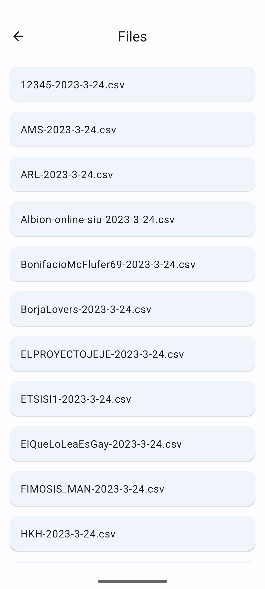

    
    <h3 align="center">Telemetry Reader</h3>
    
Sample Android app to read and plot telemetry data using Jetpack Compose.

## Table of Contents

- [🤔 What is this project?](#-what-is-this-project)
- [🎯 Key Features](#-key-features)
- [🚀 Getting Started](#-getting-started)
- [💙 Contributing](#-contributing)
- [⚠️ Disclaimer](#-disclaimer)

## 🤔 What is this project?

This project is a playground application to learn Jetpack Compose, Material Design 3 and Kotlin, with the *excuse* of plotting telemetry data from CSV files. This application showcases:

- Layouts: Column, Row, Box, and ConstraintLayout for structuring UI elements.
- Material Components: Button, Card, TextField, Snackbar, TopAppBar, and more, adhering to Material Design guidelines.
- State Management: Utilization of remember, mutableStateOf, and LaunchedEffect for managing UI state.
- Charts: line charts using Vico library.

This playground is a valuable resource for developers looking to explore and understand Jetpack Compose's capabilities in building modern Android UIs.

## 🎯 Key Features

- Line chart plotting of csv data. User can select what measure to plot, followed by instant-refesh of what is shown. Y-Axis scale follows data range, while X-axis display timestamp of the measure on HH:mm:ss format.

  

- Moreover, user can click on each measure to check the exact data.

  

- CSV reader and parser, able to scan all local CSV files and plot them in a LazyColumn so the user can select any.

  

- Light/dark responsive UI, following device mode.

  

- Simple menu to start navigating:

  

## 🚀 Getting Started

Code can be compiled in Android Studio without any extra dependency.

## 💙 Contributing

Any contributions you make are **greatly appreciated**, so if you have any idea of how to make this project better, please [create a pull request](https://github.com/VicDominguez/Telemetry-Reader/pulls). Also if you find any bug, please [create an issue](https://github.com/VicDominguez/Telemetry-Reader/issues/new).

## ⚠️ Disclaimer

This project was originally created in 2023 by [@VicDominguez](https://github.com/VicDominguez) together with ETSISI-UPM (School of Computer Systems Engineering, Polytechnic University of Madrid), to be used as a programming playground by 15–16 year-old students (Sophomore course
in USA, Year 11 in UK, 4º ESO in Spain).
